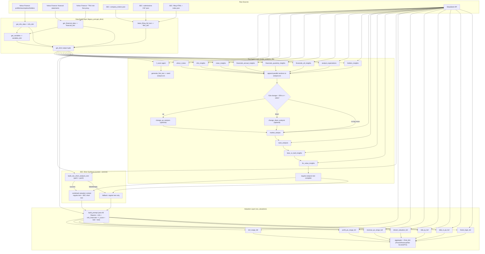

# AI_HEDGE_2 Dependency Map: Sources -> Text Agents -> Valuators

## Scope
This document maps runtime dependencies in the current pipeline implementation, focused on:
- raw data sources
- text-generating agents
- valuation agents
- ordering and prerequisites (what must happen before each component can work)

Primary code paths:
- `src/ai_hedge/runner.py`
- `src/ai_hedge/service.py`
- `src/ai_hedge/lite_test.py`
- `src/ai_hedge/legacy_port.py`

---

## 1) Runtime Entrypoints

### Full valuation mode
- `service.run_full_analysis()` -> `runner.run_ticker_valuation()` -> `legacy_port.make_analysis_file()` -> `legacy_port.run_valuations()`

### Lite mode
- `service.run_lite_analysis()` -> `lite_test.run_lite_test()` -> `legacy_port.get_dicts()` -> small subset of text agents + 2 valuators

### SEC-only mode
- `service.run_sec_analysis_full()` / `service.run_sec_analysis_short()` -> `service._run_sec_analysis()` -> `legacy_port.get_dicts()` + SEC text synthesis in `service._generate_sec_analysis_text()`

---

## 2) Global Preconditions

Required before meaningful output:
- Valid ticker format (`service.is_valid_ticker`)
- `DEEPSEEK_API_KEY` present (`runner._require_api_key`, `service._ensure_deepseek_api_key`, `lite_test._require_api_key`)
- Network access to:
  - DeepSeek API (`legacy_port.deepseek_simple_text`)
  - Yahoo Finance (`yfinance.Ticker(...)` in data collectors)
  - SEC EDGAR (`requests.get(...)` in filing collectors)

Functional gate:
- `info_dict["short_name"]` must be truthy, or full valuation exits early.

---

## 3) Raw Source Dependencies

### Yahoo Finance sources
- Company profile and market fields: `ticker_obj.info`
- Analyst datasets: `analyst_price_targets`, `recommendations`, `upgrades_downgrades`, `earnings_estimate`, `revenue_estimate`
- News: `ticker_obj.news`
- Options: first expiry option chain calls/puts
- Ownership/holders datasets
- Financial statements: annual/quarterly income statement, balance sheet, cash flow
- Risk-free proxy: `^TNX` history for 10-day average yield

### SEC sources
- CIK lookup: `https://www.sec.gov/files/company_tickers.json`
- Submission index: `https://data.sec.gov/submissions/CIK{cik}.json`
- Filing HTML and index JSON from EDGAR archives
- Extracted outputs: filing text + extracted markdown-like tables

### LLM source
- DeepSeek (`deepseek-chat`, `deepseek-reasoner`) is used by all text agents and valuators.

---

## 4) Data-Build Layer Dependencies

`legacy_port.get_dicts(ticker)` is the root data constructor:
1. `get_info_data(ticker)` -> builds `info_dict`
2. `latest_filing_full_text(ticker)` -> builds `files_dict`
3. `get_financial_data(ticker, info_dict["info"], info_dict["financials"])` -> builds `financial_dict`
4. `get_variables(...)` using data from `info_dict` + `financial_dict` -> builds `variables_dict`

Output contract:
- `info_dict`, `files_dict`, `financial_dict`, `variables_dict`

Everything downstream depends on these four dictionaries.

---

## 5) Text Agent Layer Dependencies

## 5.1 Base text build (`make_analysis_file`)
Order:
1. Build dicts via `get_dicts`
2. Compute `f_score(...)` and inject into:
   - `financial_dict["f_score"]`
   - `variables_dict["f_score"]`
3. Reset and seed `analysis.txt` via `generate_first_text(...)`
4. Run parallel section agents (independent inputs)
5. Append parallel outputs to file sequentially
6. Optional change analysis branch (`change_up_anaysis` or `change_down_anaysis`)
7. Sequential tail agents:
   - `market_analyst`
   - `swot_analysis`
   - `bear_vs_bull_insights`
   - `for_value_insights`

### Parallel section agents and direct inputs
- `what_it_does_insights_result(info_dict)` -> needs `info_dict["info"]`
- `info_insights_result(info_dict)` -> needs `info_dict["info"]`
- `news_insights_result(info_dict)` -> needs `info_dict["short_name"]`, `info_dict["news"]`
- `financials_annual_insights_result(financial_dict, info_dict)` -> `financial_dict["Annual Reports"]`
- `financials_quarterly_insights_result(financial_dict, info_dict)` -> `financial_dict["Quarterly Reports"]`
- `financials_all_insights_result(financial_dict, info_dict)` -> `financial_dict["All Reports"]`
- `analyst_expectations_insights_result(info_dict)` -> analyst/recommendation datasets
- `holders_insights_result(info_dict, ticker)` -> holder/insider datasets

### Sequential tail dependency
`market_analyst`, `swot_analysis`, `bear_vs_bull_insights`, `for_value_insights`, and change analysis functions all read `analysis.txt`, so they depend on prior file writes.

### Agent-to-agent effect
`for_value_insights` writes "Key Insights for Valuation" into `analysis.txt`; this becomes direct context input for valuation prompts.

## 5.2 SEC short synthesis agent (runner/service path)
- `runner.run_ticker_valuation` calls `service.build_sec_short_analysis_text(...)`
- Inputs:
  - `info_dict["info"]`
  - `financial_dict["All Reports"]` (or `all_reports`)
  - `files_dict[*]["text"]`
- Internally calls DeepSeek twice (Part 1 + Part 2 prompts)
- Output:
  - `sec_short_text`
  - errors/notes
- If success: SEC short text is appended and merged into valuation context.
- If failure: fallback to regular analysis text only.

---

## 6) Valuation Layer Dependencies

Root function: `legacy_port.run_valuations(...)`

Core requirements:
- `info_dict["short_name"]` must exist
- `variables_dict` keys used by calculators:
  - `shares_outstanding`, `ev`, `market_cap`, `price`, `revenue`, `net_income`, `price_currency`, `financial_currency`
- `financial_dict` keys used in prompts:
  - `All Reports`, `info`, `info_financials`, `currency_statement`, `f_score`, optional `rate`
- text context:
  - regular analysis text or combined text (regular + SEC short)

### Valuation blocks (executed in parallel)
- `dcf_range_full` -> needs parsed JSON keys `fcf_next_year`, `g`, `WACC`, `TERMINAL`
- `profit_pe_range_full` -> needs `net_income_3y`, `pe_multiple`
- `revenue_ps_range_full` -> needs `revenue_3y`, `ev_sales_multiple`
- `dream_valuation_full` -> uses persona prompts and `target_market_cap`
- `bbb_tp_full` -> needs `bull/base/bear` probability + target market cap scenarios
- `bbb_ni_pe_full` -> needs `bull/base/bear` probability + net income scenarios + `pe_multiple`
- `forest_logic_full` -> needs `revenue_growth_3y_avg`, `operating_profitability_margin`, `net_financing_result`, `pe_multiple`

Notes:
- `target_price_full` and `sotp_full` exist but are currently not executed in `run_valuations` (commented out in the parallel launch).
- All blocks call `build_prompt(...)`, so missing `financial_dict["f_score"]` breaks prompt completeness.

### Aggregation dependencies
After block outputs:
- Price summary: `make_short_list_prices(...)`
- Revenue summary: revenue from `revenue_ps` + `forest_logic`
- Net income summary: NI from `profit_pe` + `bbb_ni_pe` + `forest_logic`
- P/E summary: PE from `profit_pe` + `bbb_ni_pe` + `forest_logic`

If `add_text=True`, `run_valuations` appends block summaries and `overall_valuation(...)` output to `analysis.txt`.

---

## 7) Full Visual Graph

---

## 8) Practical "What Must Happen Before X Works"

- Before any text agent works:
  - `get_dicts` must succeed.
  - DeepSeek key must be loaded.

- Before valuation prompts work:
  - `f_score(...)` must run and populate `financial_dict["f_score"]`.
  - `analysis.txt` should contain upstream text, ideally including "Key Insights for Valuation".

- Before SEC-augmented valuation works:
  - `build_sec_short_analysis_text(...)` must return non-empty text.
  - Else automatic fallback uses regular analysis only.

- Before final valuation metrics are meaningful:
  - At least one valuation block must return valid parsed JSON and non-empty numeric output.

---

## 9) Current Disabled/Optional Links

- In `make_analysis_file`, these are currently commented out:
  - `options_analyst_insights_result`
  - `sec_files_insights_results`
  - `sec_tables_insights_results`

- In `run_valuations`, these are currently commented out:
  - `target_price_full`
  - `sotp_full`

They exist and can be reconnected, but they are not active dependencies in current full valuation runtime.
